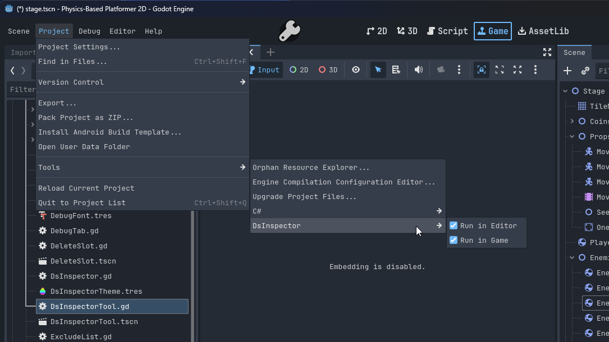
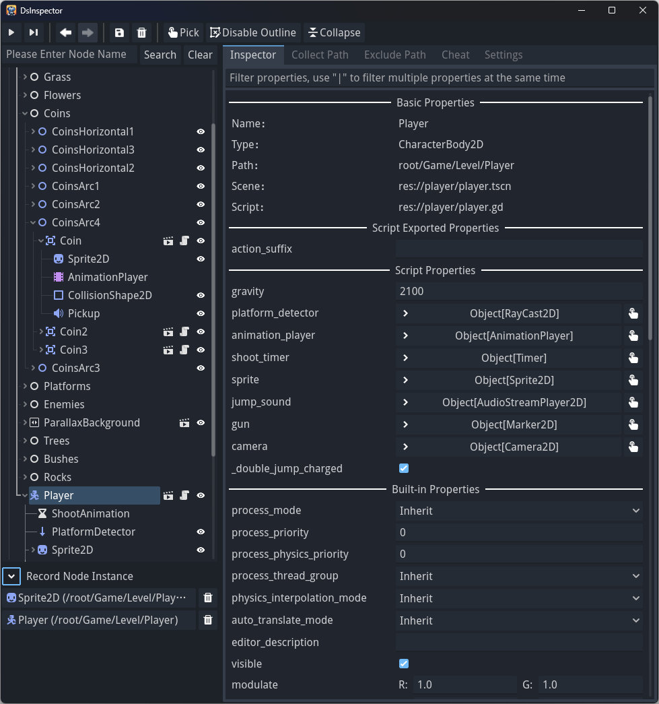
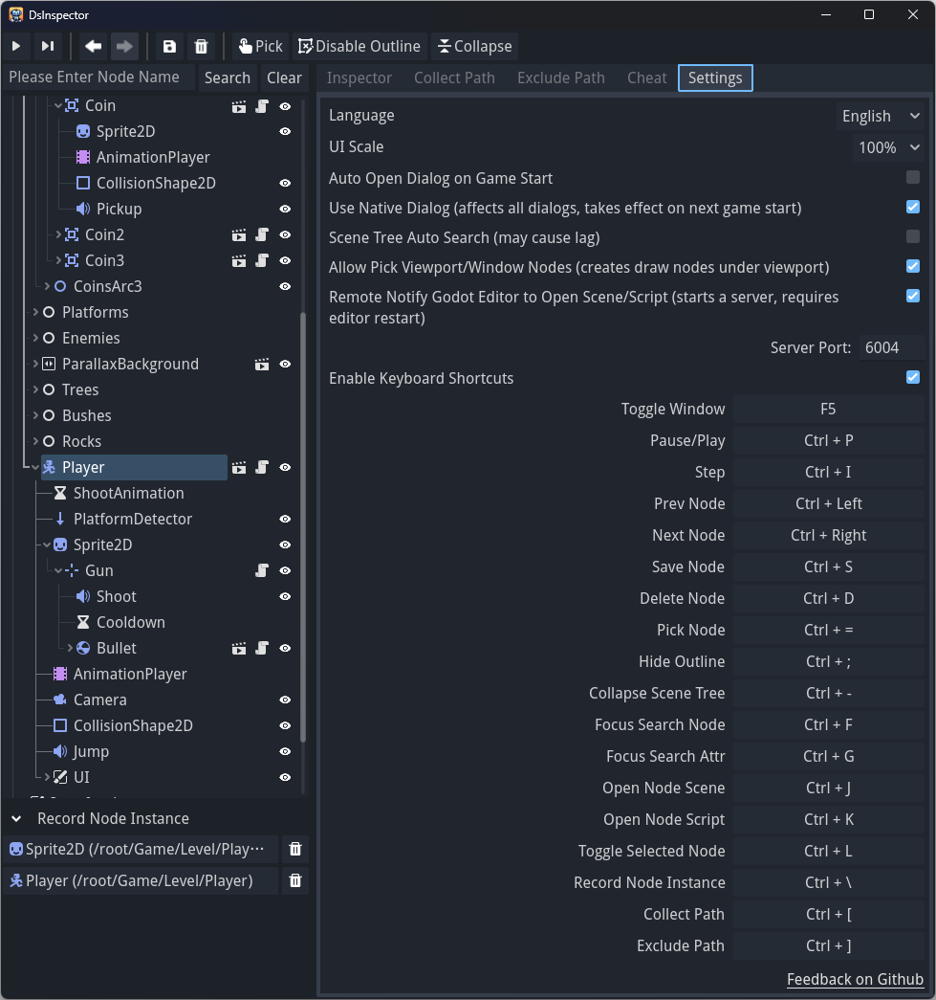
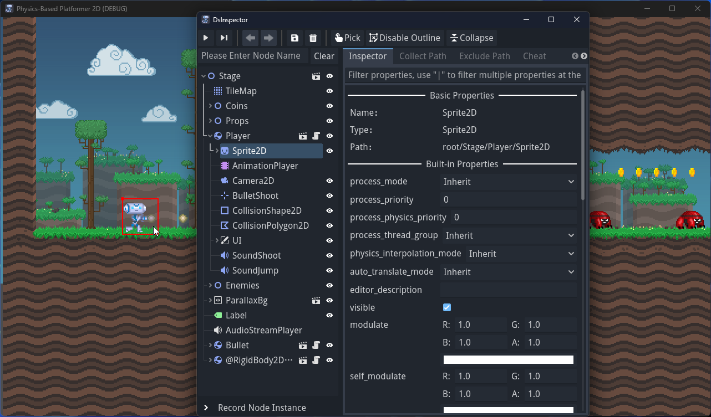
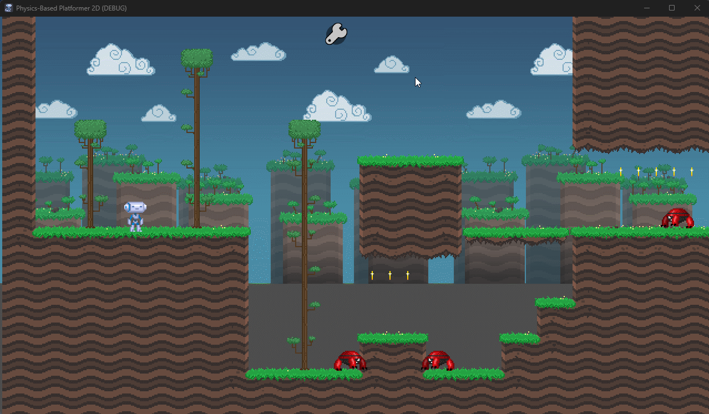
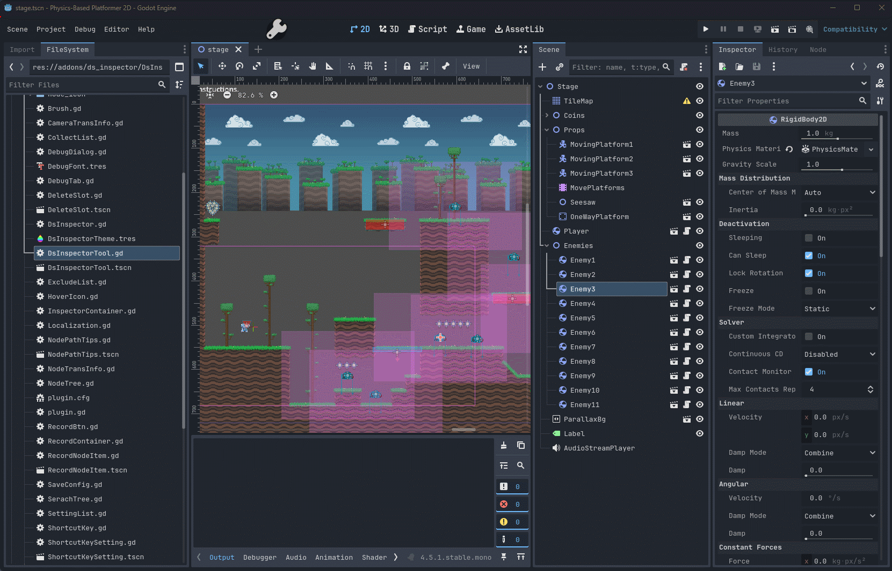

# DsInspector

[English](README.md)|[中文](README_zh.md)

**DsInspector（Developer Support Inspector）** 是一个用于 **Godot 4** 的运行时调试插件，允许你在游戏运行时实时查看和修改场景树中的节点和属性。
它提供类似于编辑器 Inspector 的功能，让开发者在调试和测试过程中更加方便直观。


作者bilibbili主页：https://space.bilibili.com/259437820

## 功能特性

* **实时节点树查看**：显示当前运行场景中的所有节点，允许鼠标拖拽移动节点位置，仅支持2D场景检查，不支持3D场景。
* **节点属性检查**：支持查看和修改节点的属性值（包括脚本导出变量），修改属性后立即生效，支持属性筛选，可以使用"|"来拆分多个筛选条件。
* **节点搜索**：快速查找目标节点。
* **节点选中高亮**：在游戏画面中定位选中的节点，选择“拣选节点”后点击场景内元素即可选择节点，如果元素堆叠，连续点击元素即可依次选中节点。
* **记录节点实例**：拖拽节点放入记录区域，点击记录的节点可以快速跳转。临时记录节点，当节点销毁就会移除记录。
* **收藏路径**：收藏指定的路径，永久保存，点击可以跳转到该路径的节点。
* **排除路径**：过滤指定路径，永久保存，拣选时不会选中该路径下的节点。
* **单帧运行**：暂停游戏，并且一帧一帧运行游戏。
* **打开脚本/场景路径**：在属性面板中可快速打开绑定的脚本或场景文件，方便快速编辑。
* **将节点保存为场景**：支持将选中的节点导出并保存为新的场景（例如 `.tscn`），便于复用和共享。
* **做弊按钮**：可以通过 `DsInspector.add_cheat_button()` 快速添加做弊按钮。
* **导出自动屏蔽插件**：该插件仅在编辑器运行游戏时生效，导出游戏后自动屏蔽插件所有功能，无需做额外设置。
* **支持C#版本**：无需额外设置，直接可以导入到C#版本工程中，正常识别C#脚本、`[export]`属性。
* **Godot编辑器中运行插件**：允许将该插件运行在编辑器中，可用于实时查看编辑内部节点树，开发编辑器插件不再摸黑（该功能在3x版本的插件暂不支持）
* **多语言支持**：可以在设置中切换，当前支持的语言包括：简体中文 (zh)、繁體中文 (zh_tw)、英语 (en)、西班牙语 (es)、日语 (ja)、俄语 (ru)。

## 支持版本

本插件针对 Godot 4.2+ 系列开发和测试，不支持更低版本。

如需在Godot3x中使用，请使用该仓库：
👉 https://github.com/xlljc/DsInspector_GD3

## 安装方法

1. 将本仓库克隆，并将 `addons/` 复制到你的 Godot 工程的 `addons/` 文件夹下。
2. 在 `project.godot` 中启用插件：

   * 打开 `Project > Project Settings > Plugins`
   * 找到 `DsInspector` 并启用
3. 运行游戏后会自动出现一个悬浮窗口，点击悬浮窗口即可打开检查器。
4. 也可以通过`项目/工具/DsInspector`下选项指定是否允许在编辑器或游戏中。



## 预览

检查器窗口





拣选场景中的物体





拣选Godot编辑器节点



## C#项目

在C#项目中使用作弊按钮可以通过以下包装类

```c#
using Godot;

/// <summary>
/// 提供与 DsInspector 单例交互的静态方法，用于添加作弊按钮。
/// 该类需要在 SceneTree 初始化后使用，通过 <see cref="Init(SceneTree)"/> 方法进行初始化。
/// </summary>
public static class CheatManager
{
    private static SceneTree _tree;
    private static Node _dsInspector;

    /// <summary>
    /// 初始化CheatManager，传入SceneTree实例
    /// </summary>
    public static void Init(SceneTree tree)
    {
        _tree = tree;
        _dsInspector = null;
    }

    private static Node GetDsInspector()
    {
        if (_tree == null)
        {
            GD.PrintErr("CheatManager未初始化，请先调用CheatManager.Init(SceneTree tree)");
            return null;
        }
        if (_dsInspector == null)
            _dsInspector = _tree.Root.GetNodeOrNull("DsInspector");
        return _dsInspector;
    }

    /// <summary>
    /// 向DsInspector添加作弊按钮（调用GDScript单例方法）
    /// </summary>
    public static void AddCheatButton(string title, Node target, string method)
    {
        var dsInspector = GetDsInspector();
        if (dsInspector != null)
            dsInspector.Call("add_cheat_button", title, target, method);
    }

    /// <summary>
    /// 向DsInspector添加作弊按钮（通过Callable）
    /// </summary>
    public static void AddCheatButtonCallable(string title, Callable callable)
    {
        var dsInspector = GetDsInspector();
        if (dsInspector != null)
            dsInspector.Call("add_cheat_button_callable", title, callable);
    }
}
```


## 许可证

本项目使用 **MIT License**。
